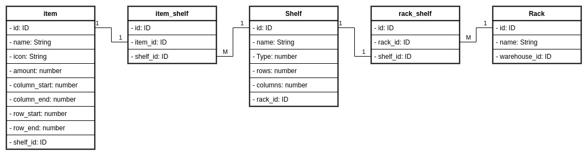

# Stockrage: Stock and Storage

### Idea principal

La idea principal es contar con un sistema que no solo pueda guardar los datos de un stock (ya sea de una ferreteria), sino en la que se pueda visualizar en que parte del armario esta guardado este item, material, recurso, etc.

Como futura actualización, tambien se prodra incorporar donde estaran ubicados los estantes en los galpones de almacenamiento.

---

## Parte Técnica

El sistema va a estar separado en dos partes: Backend (Laravel) y Frontend (React)

### Diagrama: Entidad Relación

